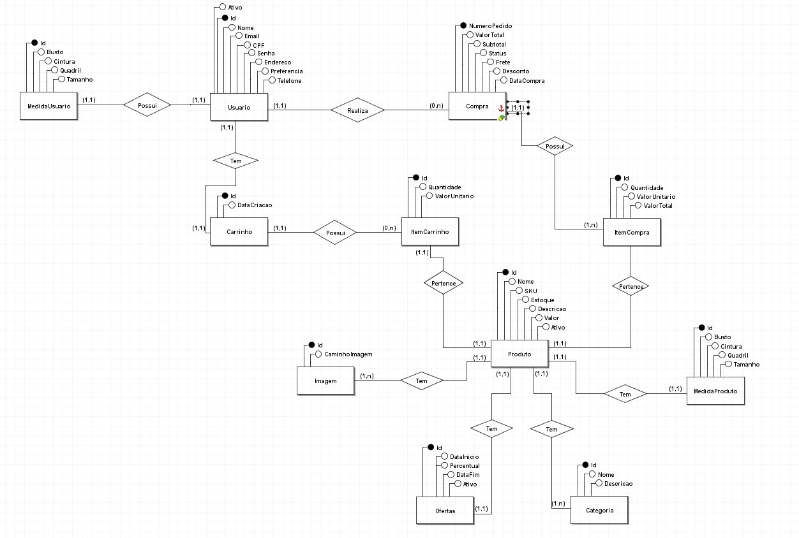
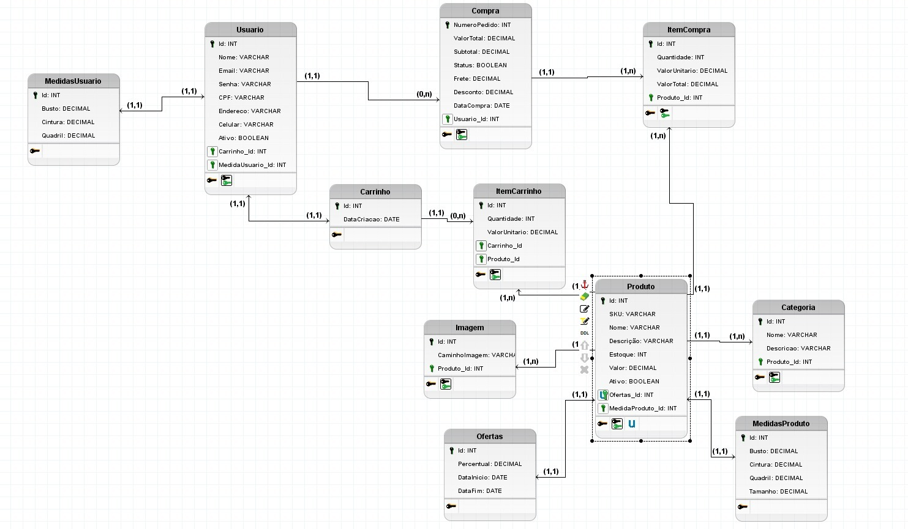

<p align="left" style="font-size:28px;"><strong><em>Documentação do PI</em></strong></p>
<details>
<summary><strong>📌 Sumário</strong></summary>

- [1. Introdução](#1-introdução)
- [Objetivos](#-objetivos)
- [Metodologia](#-metodologia)
- [2. Requisitos](#2-requisitos)
- [Requisitos funcionais](#-requisitos-funcionais)
- [Requisitos não funcionais](#-requisitos-não-funcionais)
- [3. Modelo de casos de uso](#3-modelo-de-casos-de-uso)
- [4. Modelo do banco de dados](#4-modelo-do-banco-de-dados)
- [5. Banco de dados](#5-banco-de-dados)
- [6. Diagrama de classes](#6-diagrama-de-classes)
- [7. Estudo de viabilidade](#7-estudo-de-viabilidade)
- [8. Regras de negócio (Modelo canvas)](#8-regras-de-negócio-modelo-canvas)
- [9. Design](#9-design)
- [10. Protótipo](#10-protótipo)
- [11. Aplicação](#11-aplicação)

</details>

Para cada semestre, do 1º ao 6º, iremos utilizar este template para documentar o PI -
incrementalmente.

# 1. Introdução
O mercado de moda plus size enfrenta um paradoxo crítico no ambiente digital: embora represente uma parcela significativa dos consumidores, a oferta de plataformas de compra adequadas ainda é escassa. Dados alarmantes revelam que **61% das pessoas plus size** relatam dificuldades persistentes para encontrar roupas que atendam às suas necessidades. 

Essa lacuna é agravada pela baixa qualidade das interfaces de venda, visto que **90% dos sites de e-commerce** negligenciam aspectos fundamentais da experiência do usuário (UX). Diante desse cenário, o presente projeto propõe o desenvolvimento de um catálogo digital especializado, focado prioritariamente em suprir essas carências por meio de um design centrado no ser humano, garantindo acessibilidade, representatividade e eficiência no processo de compra.

## • Objetivos
O projeto visa transformar a jornada de compra do consumidor plus size por meio de metas estratégicas e mensuráveis:

* **Experiência do Usuário (UX):** Desenvolver um catálogo digital que seja intuitivo, rápido e visualmente acolhedor, eliminando barreiras de navegação e promovendo um ambiente de consumo positivo.
* **Eficiência Operacional:** Reduzir em **30%** a taxa de devolução motivada por problemas de tamanho, utilizando ferramentas que auxiliem o cliente na escolha precisa das peças.
* **Desempenho Comercial:** Alcançar um aumento de **15%** na taxa de conversão durante o primeiro semestre de operação do catálogo.
* **Fidelização:** Construir uma base sólida de clientes fiéis, estabelecendo uma relação de confiança entre a marca e o público por meio da atenção às suas dores específicas.
* **Escalabilidade:** Estruturar o catálogo como uma base robusta para a futura expansão rumo a um ecossistema de e-commerce completo.
  
## • Metodologia
(Que métodos, tecnologias, modelos de processo, ferramentas irá utilizar?
Responde à pergunta: Como? Com o que? Onde? Quando?)

# 2. Requisitos

## • Requisitos funcionais

| Código | Nome | Descrição |
|--------|------|----------|
| RF01 | Cadastro de Usuário | O sistema deve permitir que o usuário se cadastre informando nome completo, CPF, RG, e-mail, senha, data de nascimento, endereço completo e telefone. |
| RF02 | Autenticação de Usuário | O sistema deve permitir login com e-mail e senha previamente cadastrados. |
| RF03 | Carrossel de Produtos | O sistema deve exibir carrosséis de produtos na página inicial com base em categorias, histórico e recomendações. |
| RF04 | Barra de Pesquisa | O sistema deve possuir busca com sugestões automáticas e redirecionamento para página de resultados. |
| RF05 | Recomendações Personalizadas | O sistema deve permitir coleta de dados (com consentimento) para gerar recomendações em tempo real. |
| RF06 | Catálogo e Visualização de Produtos | O sistema deve permitir acesso ao catálogo completo e visualização de detalhes dos produtos (descrição, especificações, imagens, preço e avaliações) via API. |
| RF07 | Experiência de Compra e Favoritos | O sistema deve permitir selecionar produtos, escolher variações, definir quantidades e favoritar itens para uso futuro. |
| RF08 | Carrinho de Compras e Finalização | O sistema deve permitir adicionar produtos ao carrinho, visualizar itens e total, e finalizar a compra com integração a sistemas de pagamento. |
| RF09 | Filtro de Produtos | O sistema deve permitir filtrar produtos por categoria, preço e relevância. |
<!--| RF10 | Dashboard Administrativa | O sistema deve disponibilizar uma área exclusiva para administradores com funcionalidades de gestão. |-->
<!--| RF11 | Gestão Administrativa | O administrador deve poder realizar CRUD de usuários e produtos, além de gerenciar promoções e descontos. |-->
<!--| RF12 | Histórico de Pedidos | O sistema deve permitir visualizar compras anteriores. |-->
<!--| RF13 | Recuperação de Senha | O sistema deve permitir redefinir a senha via e-mail. |-->
<!--| RF14 | Avaliação de Produtos | O sistema deve permitir que usuários avaliem produtos. |-->
<!--| RF15 | Controle de Estoque | O sistema deve controlar automaticamente o estoque de produtos. |-->

## • Requisitos não funcionais

| Código | Nome | Descrição |
|--------|------|----------|
| RNF01 | Desempenho | O sistema deve responder às requisições em até 2 segundos em condições normais. |
| RNF02 | Escalabilidade | O sistema deve suportar múltiplos usuários simultâneos sem perda significativa de desempenho. |
| RNF03 | Disponibilidade | O sistema deve estar disponível 24/7 com alta disponibilidade. |
| RNF04 | Segurança de Dados | O sistema deve proteger os dados dos usuários com criptografia and boas práticas de segurança. |
| RNF05 | Conformidade LGPD | O sistema deve garantir privacidade e consentimento no uso dos dados dos usuários. |
| RNF06 | Usabilidade | O sistema deve possuir interface simples e intuitiva. |
| RNF07 | Responsividade | O sistema deve funcionar corretamente em desktop, tablet e dispositivos móveis. |
| RNF08 | Compatibilidade | O sistema deve ser compatível com os principais navegadores. |
| RNF09 | Manutenibilidade | O sistema deve possuir código organizado e de fácil manutenção. |
| RNF10 | Confiabilidade | O sistema deve garantir integridade e consistência dos dados. |
<!--| RNF11 | Autenticação Segura | O sistema deve armazenar senhas criptografadas e utilizar autenticação segura. |-->
<!--| RNF12 | Controle de Acesso | O sistema deve restringir o acesso à área administrativa apenas a administradores. |-->
<!--| RNF13 | Integração com APIs | O sistema deve integrar-se de forma eficiente com APIs externas. |-->
<!--| RNF14 | Backup | O sistema deve realizar backups periódicos dos dados. |-->
<!--| RNF15 | Recuperação de Falhas | O sistema deve ser capaz de se recuperar rapidamente após falhas. |-->

# 3. Modelo de casos de uso

# 4. Modelo do banco de dados


# 5. Banco de dados
## 5.1 Modelo Conceitual

  
## 5.2 Modelo Lógico


# 6. Diagrama de classes

# 7. Estudo de Viabilidade

## 7.1 Resumo Executivo e Viabilidade Financeira

O projeto propõe o desenvolvimento de um catálogo digital de moda plus size focado em solucionar falhas graves de experiência de usuário (UX) encontradas no e-commerce tradicional (como incerteza de tamanhos e falta de representatividade). O projeto demonstra alta viabilidade técnica e econômica por meio de um modelo de desenvolvimento ágil e infraestrutura enxuta.

### Indicadores Gerais de Viabilidade

| Indicador Técnico / Financeiro | Detalhes do Escopo do Projeto | Investimento / Prazo |
|:---|:---|:---|
| **Status do Projeto** | Viável e Altamente Recomendado | Foco em Demanda Reprimida |
| **Prazo Estimado (MVP)** | Ciclo de desenvolvimento ágil da plataforma | **8 a 10 semanas** |
| **Equipe Técnica** | Alocação de engenharia interna | **5 desenvolvedores** |
| **Custo Inicial (Setup)** | Formato *Bootstrapping* (Uso de licenças open-source) | **R$ 0** |
| **Custo Mensal (Infra)** | Hospedagem da plataforma e serviços de nuvem (*Host*) | **R$ 120 / mês** |
| **ROI Esperado** | Retorno baseado na retenção e conversão digital | **6 a 12 meses** |

---

## 7.2 Contexto e Justificativa

### O Problema (As Dores de UX no E-commerce)
O e-commerce convencional falha estruturalmente ao atender o público plus size. A frustração do usuário é impulsionada por fatores técnicos negligenciados por **90% das plataformas vigentes**:
* **82%** das usuárias relatam informações de tamanho insuficientes.
* **76%** apontam falta de clareza e métricas sobre o caimento das peças.
* **21%** reclamam da ausência completa de fotos com modelos reais.

### A Oportunidade e Alinhamento Técnico
O mercado plus size nacional projeta movimentar **R$ 15 bilhões até 2027**. Como as grandes marcas mantêm grades limitadas e interfaces de compra genéricas, o software proposto se posiciona como uma solução de nicho de alto impacto. 

**Proposta de Engenharia:** Desenvolver um sistema centrado nas dores da experiência do usuário, convertendo representatividade e inteligência de caimento em componentes de software aplicados à interface.

---

## 7.3 Análise de Mercado e Tendências Técnicas
O crescimento contínuo do setor exige que as novas aplicações web incorporem tecnologias emergentes para atender aos novos comportamentos de consumo mapeados para os próximos anos:
* **Smart Sizing:** Uso de processamento de dados e IA para recomendação automatizada de tamanhos.
* **Autenticidade Visual:** UI construída com mídias dinâmicas e diversidade real (fator essencial para 83% dos usuários).
* **Interface Responsiva:** Foco no público líder do segmento (mulheres entre 26 a 40 anos), caracterizadas como nativas digitais altamente ativas em plataformas móveis.

---

## 7.4 Análise de Concorrência e Engenharia de Diferenciais

Enquanto os grandes players mantêm processos engessados e abordagens padronizadas, o escopo de software deste projeto ataca diretamente as brechas técnicas mapeadas no mercado:

| Concorrente | Limitações do Produto Atual | Solução Implementada no Projeto (Escopo MVP) |
|:---|:---|:---|
| **Grandes Redes (Ex: Renner / Shein)** | Catálogos sazonais reduzidos e fluxos de navegação genéricos. | **Filtros Avançados:** Segmentação refinada por tipo de corpo, elasticidade do tecido e compressão. |
| **Marcas Tradicionais (Ex: Marisa Plus)** | Interfaces visuais obsoletas e pouca inovação técnica. | **UI Inclusiva:** Design System focado em acessibilidade, acolhimento e alta representatividade em mídia. |
| **Mercado de E-commerce Geral** | Tabelas estáticas e guias de tamanho imprecisos. | **Guia Antropométrico:** Sistema de medidas interativo baseado na anatomia real do público-alvo. |

---

## 7.5 Especificação Técnica

### Funcionalidades do MVP
* Catálogo com filtros avançados;
* Página detalhada de produtos;
* Guia de tamanhos interativo;
* Recomendação de tamanho;
* Cadastro de usuários;
* Wishlist;
* Interface responsiva e acessível.

### Funcionalidades Futuras
* Integração com pagamentos;
* Carrinho de compras;
* Provador virtual;
* Aplicativo mobile;
* Programa de fidelidade;
* Integração com redes sociais.

---

## 7.6 Matriz de Riscos e Mitigação do MVP

| Risco Mapeado | Probabilidade | Impacto | Ação de Mitigação (Abordagem de Engenharia) |
|:---|:---:|:---:|:---|
| **Crescimento excessivo do escopo** | Alta | Alto | Divisão em sprints semanais fixas e aplicação de priorização rígida do *backlog*. |
| **Inconsistência de tabelas e caimentos** | Média | Alto | Padronização estrutural dos dados de produtos e guia antropométrico interativo. |
| **Rotatividade de desenvolvedores (Turnover)**| Média | Alto | Manutenção de documentação técnica rigorosa e adoção de práticas de *pair programming*. |
| **Baixa adoção/engajamento inicial** | Média | Médio | Lançamento em formato Beta fechado orientado a testes contínuos com grupos de usuários reais. |

---

## 7.7 Conclusão e Recomendações

O desenvolvimento da aplicação é viável devido ao baixo investimento operacional requerido pela equipe de engenharia e à existência de uma demanda digital reprimida expressiva.

### Pontos Fortes do Projeto
* Arquitetura inicial enxuta baseada em *bootstrapping*;
* Diferenciais de UX claros frente aos grandes competidores;
* Estrutura de código escalável pronta para migrar de catálogo para e-commerce transacional.

### Próximos Passos (Plano de Ação para 4 Semanas)
* **Semana 1:** Alinhamento de Product Owner e validação do protótipo de alta fidelidade com 5 usuárias do nicho.
* **Semana 2:** Estruturação da base de dados e setup dos ativos visuais e parcerias de mídia.
* **Semana 3 (Sprint 0):** Inicialização do ambiente de desenvolvimento, definição da arquitetura do software e implementação do Design System.
* **Semana 4:** Deploy de Landing Page responsiva para captação de leads e triagem da base de usuários beta.

---

## 7.8 Anexos

### Checklist de UX Plus Size
* Fotos com modelos reais;
* Guia de medidas detalhado;
* Informações sobre caimento;
* Filtros por tipo corporal;
* Linguagem inclusiva;
* Zoom em alta resolução;
* Avaliações com fotos de clientes.

### Referências
* Associação Brasil Plus Size (ABPS);
* Fortune Business Insights;
* Baymard Institute;
* Sizebay;
* Construsite Brasil;
* Accio.
  
# 8. Regras de negócio (Modelo canvas)


# 9. Design
# Bia Modas — Design System

> Relatório completo de tipografia, paleta de cores e uso de cada elemento no projeto Bia-Modas.

---

## Fontes / Tipografias

### Importação (Google Fonts CDN)

Todas as 7 páginas HTML importam as mesmas duas famílias via CDN:

```html
<link href="https://fonts.googleapis.com/css2?family=Poppins:wght@300;400;500;600;700&family=Playfair+Display:wght@400;500;600;700&display=swap" rel="stylesheet">
```

| Fonte | Pesos Importados | Variável CSS | Uso |
|-------|-----------------|--------------|-----|
| **Poppins** | 300, 400, 500, 600, 700 | `--font-primary` | Corpo geral da página, formulários, botões, navegação, abas de perfil |
| **Playfair Display** | 400, 500, 600, 700 | `--font-display` | Títulos de destaque, hero banner, nomes de produto, seções |

### Onde cada fonte é usada

#### Poppins (`--font-primary`)

- `body` — texto corrido de toda a página
- `.form-control` — campos de formulário (login, registro, perfil)
- `.wizard-nav .btn` — botões de navegação do wizard de registro
- `.profile-tab` — abas do perfil do usuário

#### Playfair Display (`--font-display`)

| Elemento | Arquivo |
|----------|---------|
| Título do Hero Banner (`hero-content h1`) | `layout.css` |
| Títulos de seção (`section-header h2`) | `layout.css` |
| Título da Newsletter (`newsletter-section h2`) | `layout.css` |
| Título do overlay de categoria (`category-overlay h3`) | `components.css` |
| Título do carrinho (`cart-header h3`) | `components.css` |
| Título do card de auth (`auth-card-header h1`) | `auth.css` |
| Nome do produto (`#product-name`) | `produto.html` (inline) |
| Nome do usuário no perfil (`#profile-name`) | `usuario.html` (inline) |
| Título da página de categoria (`page-header h1`) | `categoria.html` (inline) |
| Título do offcanvas de filtros (`filter-offcanvas-header h3`) | `categoria.html` (inline) |

---

## Paleta de Cores

### Variáveis CSS (definidas em `css/base.css`)

```css
:root {
    --color-primary: #d1001f;
    --color-primary-dark: #ae031c;
    --color-secondary: #f8f9fa;
    --color-dark: #212529;
    --color-gray: #6c757d;
    --color-light-gray: #e9ecef;
    --font-primary: 'Poppins', sans-serif;
    --font-display: 'Playfair Display', serif;
}
```

---

### `--color-primary` → `#d1001f` (Vermelho da marca)

**Propósito:** Cor principal da marca. Usada em todos os elementos de destaque, CTA e identidade visual.

| Onde é usada | Arquivo → Seletor |
|--------------|-------------------|
| Fundo da top bar (barra superior vermelha) | `layout.css` → `.top-bar` |
| Fundo do botão da search bar | `layout.css` → `.search-box button` |
| Hover dos ícones do header | `layout.css` → `.header-actions a:hover` |
| Badge do carrinho (contador) | `layout.css` → `.badge-count` |
| Hover dos links da nav | `layout.css` → `.main-nav .nav-link:hover` |
| Ícones da seção de features | `layout.css` → `.feature-icon` |
| Linha decorativa dos títulos de seção | `layout.css` → `.section-header .line` |
| Fundo da seção newsletter | `layout.css` → `.newsletter-section` |
| Hover dos links do footer | `layout.css` → `.footer-widget ul li a:hover` |
| Ícones de contato do footer | `layout.css` → `.footer-contact i` |
| Hover dos ícones sociais | `layout.css` → `.social-links a:hover` |
| Fundo dos botões primários customizados | `components.css` → `.btn-primary-custom`, `.btn-primary-solid` |
| Badge de produto ("Novo", "-31%") | `components.css` → `.product-badge` |
| Hover dos botões de ação do produto | `components.css` → `.product-actions button:hover` |
| Preço atual do produto | `components.css` → `.price-current` |
| Borda do link de categoria | `components.css` → `.category-overlay a` |
| Preço do item no carrinho | `components.css` → `.cart-item-price` |
| Total do carrinho | `components.css` → `.cart-total span:last-child` |
| Hover dos botões do carrossel | `components.css` → `.carousel-btn:hover` |
| Dot ativo do carrossel | `components.css` → `.carousel-dot.active` |
| Hover do nome da categoria no grid | `components.css` → `.category-circle-item:hover .category-circle-name` |
| Avatar do usuário logado | `auth.css` → `.auth-avatar-logged` |
| Avatar do dropdown | `auth.css` → `.auth-dropdown-avatar` |
| Step ativo/completado do wizard | `auth.css` → `.wizard-step-indicator.active .wizard-step-dot` |
| Linha do step completado | `auth.css` → `.wizard-step-indicator.completed:not(:last-child)::after` |
| Asterisco de campo obrigatório | `auth.css` → `.auth-form label .required` |
| Hover do toggle de senha | `auth.css` → `.password-toggle:hover` |
| Tag checkbox selecionada | `auth.css` → `.checkbox-tag input:checked + label` |
| Botão primário do wizard | `auth.css` → `.wizard-nav .btn-primary` |
| Aba ativa do perfil | `auth.css` → `.profile-tab.active` |

---

### `--color-primary-dark` → `#ae031c` (Vermelho escuro)

**Propósito:** Estado hover/ativo dos elementos primários.

| Onde é usada | Arquivo → Seletor |
|--------------|-------------------|
| Hover do botão da search bar | `layout.css` → `.search-box button:hover` |
| Hover do botão primário sólido | `components.css` → `.btn-primary-solid:hover` |
| Hover do botão primário do wizard | `auth.css` → `.wizard-nav .btn-primary:hover` |

---

### `--color-secondary` → `#f8f9fa` (Cinza muito claro)

**Propósito:** Fundo de seções alternadas e elementos neutros.

| Onde é usada | Arquivo → Seletor |
|--------------|-------------------|
| Fundo da navegação principal | `layout.css` → `.main-nav` |
| Fundo da seção de features | `layout.css` → `.features-section` |
| Fundo dos itens do carrinho | `components.css` → `.cart-item` |
| Header do dropdown de auth | `auth.css` → `.auth-dropdown-header` |
| Hover dos itens do dropdown | `auth.css` → `.auth-dropdown-item:hover` |

---

### `--color-dark` → `#212529` (Quase preto)

**Propósito:** Texto principal, títulos e elementos escuros.

| Onde é usada | Arquivo → Seletor |
|--------------|-------------------|
| Cor do texto do body | `base.css` → `body` |
| Ícones do header (conta, favoritos, carrinho) | `layout.css` → `.header-actions a` |
| Links da navegação | `layout.css` → `.main-nav .nav-link` |
| Títulos de seção | `layout.css` → `.section-header h2` |
| Fundo do botão da newsletter | `layout.css` → `.newsletter-form button` |
| Títulos dos produtos | `components.css` → `.product-title` |
| Ícones de ação do produto | `components.css` → `.product-actions button` |
| Botões do carrossel | `components.css` → `.carousel-btn` |
| Nomes das categorias no grid | `components.css` → `.category-circle-item` |
| Botão de fechar carrinho | `components.css` → `.cart-close` |
| Título do card de auth | `auth.css` → `.auth-card-header h1` |
| Nome no dropdown | `auth.css` → `.auth-dropdown-info strong` |
| Itens do dropdown | `auth.css` → `.auth-dropdown-item` |
| Labels dos formulários | `auth.css` → `.auth-form label` |
| Botão secundário do wizard | `auth.css` → `.wizard-nav .btn-secondary` |

---

### `--color-gray` → `#6c757d` (Cinza médio)

**Propósito:** Texto secundário, descrições, preços originais, informações auxiliares.

| Onde é usada | Arquivo → Seletor |
|--------------|-------------------|
| Descrições das features | `layout.css` → `.feature-box p` |
| Subtítulos de seção | `layout.css` → `.section-header p` |
| Categoria do produto | `components.css` → `.product-category` |
| Preço original (riscado) | `components.css` → `.price-original` |
| Carrinho vazio | `components.css` → `.cart-empty` |
| Email no dropdown | `auth.css` → `.auth-dropdown-info span` |
| Labels do wizard | `auth.css` → `.wizard-step-label` |
| Toggle de senha | `auth.css` → `.password-toggle` |
| Texto do footer de auth | `auth.css` → `.auth-footer` |
| Texto auxiliar dos formulários | `auth.css` → `.form-text` |
| Abas inativas do perfil | `auth.css` → `.profile-tab` |

---

### `--color-light-gray` → `#e9ecef` (Cinza claro)

**Propósito:** Bordas, divisores, fundos de estados vazios, tracks.

| Onde é usada | Arquivo → Seletor |
|--------------|-------------------|
| Borda superior da nav | `layout.css` → `.main-nav` |
| Borda do input de busca | `layout.css` → `.search-box input` |
| Divisor do header do carrinho | `components.css` → `.cart-header` |
| Divisor do footer do carrinho | `components.css` → `.cart-footer` |
| Borda dos botões do carrossel | `components.css` → `.carousel-btn` |
| Fundo dos dots do carrossel | `components.css` → `.carousel-dot` |
| Divisor do dropdown | `auth.css` → `.auth-dropdown-divider` |
| Borda dos inputs de formulário | `auth.css` → `.auth-form .form-control` |
| Barra de força da senha | `auth.css` → `.password-strength-bar` |
| Divisor da nav do wizard | `auth.css` → `.wizard-nav` |
| Divisor do footer de auth | `auth.css` → `.auth-footer` |
| Borda das abas do perfil | `auth.css` → `.profile-tabs` |

---

## 🔧 Cores Hardcoded (Hex direto no CSS/HTML)

### Cores de fundo e texto

| Cor | Onde | Propósito |
|-----|------|-----------|
| `#ffffff` | `body`, `.main-header`, `.product-card`, dropdown de auth | Fundo branco puro para páginas, cards e componentes |

### Cores de suporte/semânticas

| Cor | Onde | Propósito |
|-----|------|-----------|
| `#28a745` | Badge de desconto (`.price-discount`) | Verde — indica economia/desconto |
| `#dc3545` | Botão remover do carrinho, erro de validação | Vermelho — ação destrutiva/erro |
| `#a71d2a` | Hover do botão remover | Vermelho escuro |
| `#25d366` | Botão "Finalizar no WhatsApp", ícone do toast | Verde WhatsApp |
| `#128c7e` | Hover do botão WhatsApp | Verde WhatsApp escuro |

### Sombras e overlays

| Valor | Onde | Propósito |
|-------|------|-----------|
| `rgba(0,0,0,0.1)` | Sombra do header | Elevação sutil |
| `rgba(0,0,0,0.6)` / `rgba(0,0,0,0.2)` | Overlay do hero banner | Gradiente escuro para legibilidade do texto |
| `rgba(0,0,0,0.08~0.15)` | Sombras dos cards | Elevação dos product cards |
| `rgba(255,255,255,0.5~0.7)` | Footer — links e copyright | Texto semi-transparente no footer escuro |

### Gradientes

| Gradiente | Onde | Propósito |
|-----------|------|-----------|
| `linear-gradient(135deg, #fff5f5 0%, #ffffff 50%, #f8f9fa 100%)` | Página de auth (`.auth-page`) | Fundo sutil rosa/branco/cinza para login/registro |

---

## Paleta do Dark Mode (`css/dark-mode.css`)

Quando `data-theme="dark"` está ativo no `<html>`:

| Elemento | Cor no Dark Mode |
|----------|-----------------|
| Fundo do body | `#0f0f0f` |
| Header principal | `#1a1a1a` |
| Cards de produto | `#1e1e1e` |
| Inputs de formulário | `#252525` |
| Bordas de cards/inputs | `#2a2a2a` / `#3a3a3a` |
| Texto principal | `#f0f0f0` |
| Texto secundário | `#a0a0a0` |
| Placeholder dos inputs | `#888` |
| Hover dos links | Mantém `--color-primary` (`#d1001f`) |

---

## Bootstrap

- **Versão:** 5.3.3 via CDN
- **Customização de tema:** **NENHUMA** — não há override de variáveis Bootstrap (`--bs-primary`, `--bs-secondary`, etc.)
- O visual da marca é feito inteiramente pelas classes customizadas e pelas 6 variáveis `--color-*` definidas em `base.css`
- Classes utilitárias do Bootstrap são usadas extensivamente (`container`, `row`, `col-*`, `d-none`, `text-center`, etc.)

---

## Resumo Visual da Paleta

```
┌─────────────────────────────────────────────────────────┐
│  PRIMARY        #d1001f  ████  Vermelho da marca        │
│  PRIMARY-DARK   #ae031c  ████  Hover primário           │
│  SECONDARY      #f8f9fa  ████  Fundo de seções neutras  │
│  DARK           #212529  ████  Texto principal          │
│  GRAY           #6c757d  ████  Texto secundário         │
│  LIGHT-GRAY     #e9ecef  ████  Bordas e divisores       │
├─────────────────────────────────────────────────────────┤
│  SUCESSO        #28a745  ████  Desconto / Válido        │
│  ERRO           #dc3545  ████  Remover / Inválido       │
│  WHATSAPP       #25d366  ████  Checkout WhatsApp        │
├─────────────────────────────────────────────────────────┤
│  DARK MODE BODY #0f0f0f  ████  Fundo escuro             │
│  DARK CARD      #1e1e1e  ████  Cards escuros            │
│  DARK INPUT     #252525  ████  Inputs escuros           │
└─────────────────────────────────────────────────────────┘
```

---


# 10. Protótipo
(Gere um protótipo funcional na ferramenta que se sentir mais confortável (Figma, por
exemplo) e apresente aqui, indicando o link).

# 11. Aplicação
